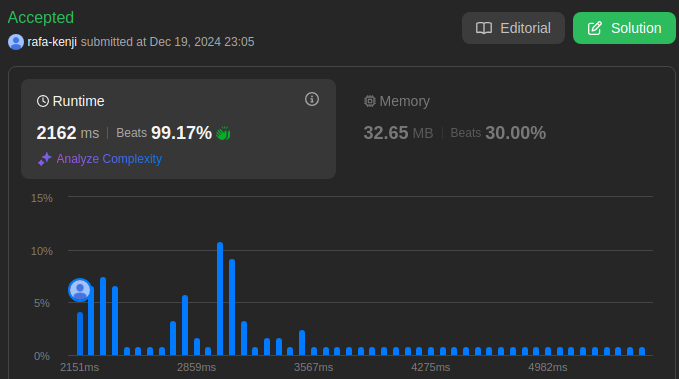
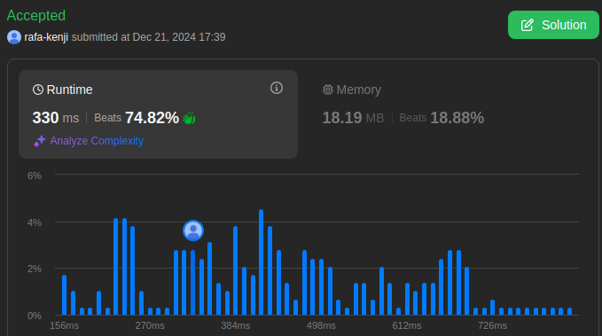
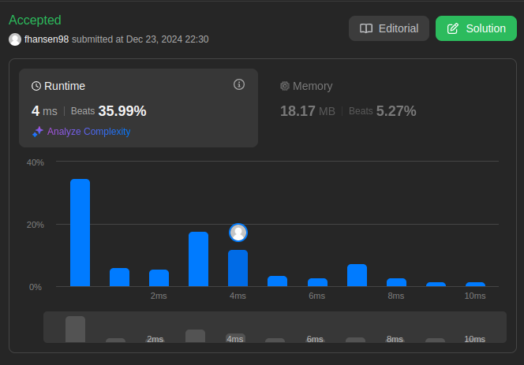

# LeetCode_Questoes

**Número da Lista**: 42 
**Conteúdo da Disciplina**: Dividir e Conquistar 

## Alunos
|Matrícula | Aluno |
| -- | -- |
| 19/0044128  |  Rafael Kenji Taira |
| 22/2032810  |  Felipe Aguiar Hansen |

## Sobre 

Este projeto consiste em quatro códigos desenvolvidos para resolver questões específicas de grafos da plataforma LeetCode. O objetivo é oferecer soluções para problemas de média e alta dificuldade em grafos, passando por problemas como encontrar o menor caminho, detectar ciclos e calcular a conectividade de nós. Cada código utiliza a linguagem Python para resolver o problema específico, aproveitando estruturas de dados otimizadas para garantir desempenho e clareza.

**Problemas**
|Código | Título | Dificuldade |
| -- | -- | -- |
| [1649](https://leetcode.com/problems/create-sorted-array-through-instructions/description/) | Create Sorted Array through Instructions | Difícil |
| [2343](https://leetcode.com/problems/query-kth-smallest-trimmed-number/description/) | Query Kth Smallest Trimmed Number | Médio |
| [4](https://leetcode.com/problems/median-of-two-sorted-arrays/description/) | Median of Two Sorted Arrays | Difícil |

## Screenshots
- Questão 1649

- Questão 2343

- Questão 4

## Uso 
**Linguagem**: Python 
Para verificar as resoluções das questões, copie a resolução da questão desejada que está dentro de sua respectiva pasta e cole na página de exercício do leetcode que tenha a questão ou no código na seção dos problemas apresentados anteriormente

## Video

### Questão Dificil 1649: [Create Sorted Array through Instructions](https://youtu.be/jdyX5URSquk)

### Questão Médio 2343: [Query Kth Smallest Trimmed Number](https://youtu.be/9Ei1IGbzjLo)